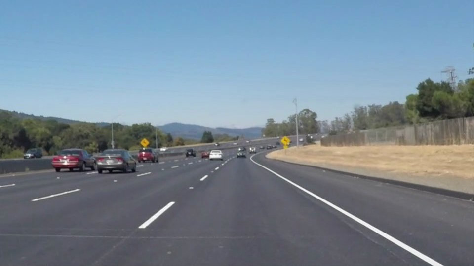
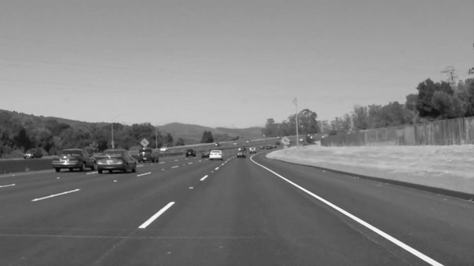
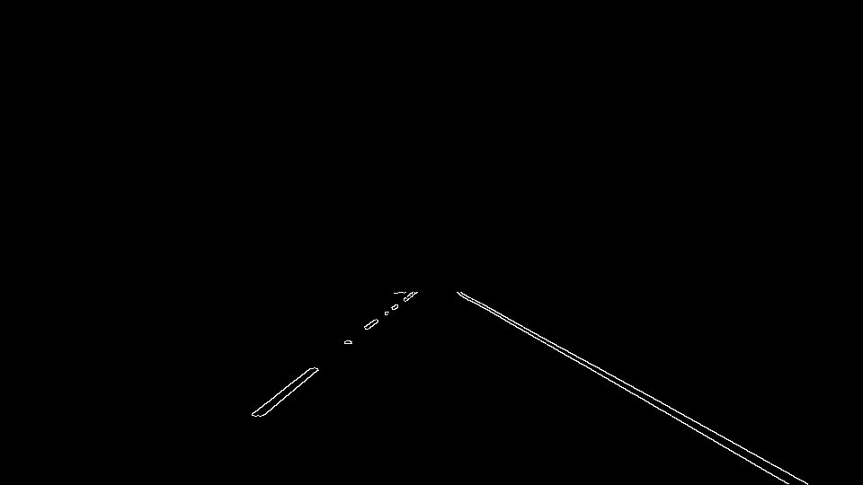
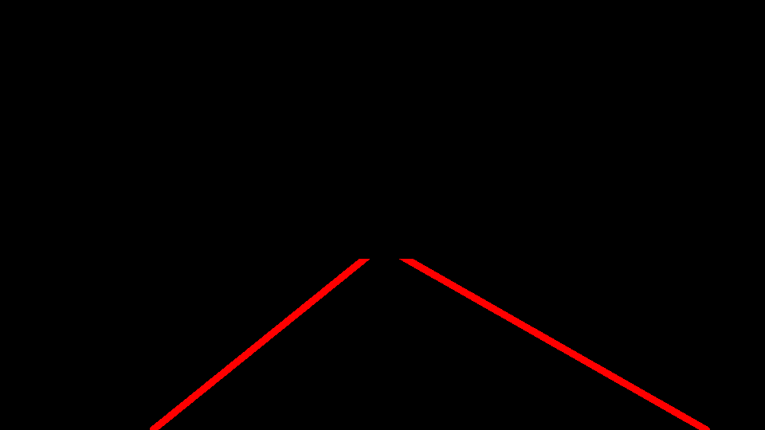
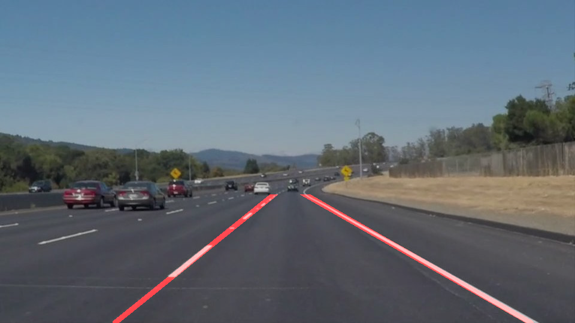

# **Finding Lane Lines on the Road** 
**Finding Lane Lines on the Road**

The goals / steps of this project are the following:
* Make a pipeline that finds lane lines on the road
* Reflect on your work in a written report

---

### Reflection

### 1. Describe your pipeline. As part of the description, explain how you modified the draw_lines() function.

My pipeline consisted of 5 steps. 
* Converting input image into grayscale
* Blur the grayscale image to remove any noise present in the content
* Use Canny method for edge detection and select edges that are part of ROI (region of interest)
* Compute Hough Transform on the previous edge image to estimate lines in the image. Call `draw_lines()` to clean all the lines to get final single left and right lane. Apply mask of ROI again to have the lane lines in ROI
* Overlay the final estimated lines on top of original image and return the image

In order to draw a single line on the left and right lanes, I modified the draw_lines() function by the following steps
* Filter all lines whose slope fall between `±20°` and `±45°`. These angles are obtained after checking the lane slopes on few images. This removed unnecessary shadow edges in the challenge video 
* Out of the remaining lines, filter each line to either left lane or right lane based on sign of angle of slope
* Find mean of `slope` and `intecept` of all lines in each left/right category
* With image as boundary points, estimate the start and end points for both lane lines 
* With `thickness` of line = `8`, draw the lines on the image

Pipeline results

a) Test Image \
 \
b) Gray Image \
 \
c) Masked Edges \
 \
d) Estimated Lines \
 \
e) Output \
 

### 2. Identify potential shortcomings with your current pipeline
* ROI changes based on camera position on the car. As ROI is currently chosen by giving vertices of polygon, they have to be tuned for each camera position
* Detecting solid lane lines is fine with the current algo. But in case of dashed lane line, if the line segments are really small the parameters for both canny, hough transform have to fine tuned or some other algo have to incorporated
* In the current image examples, there are no other vehicles infront of our vehicle. It could happen that edges of that vehicle can distrub our calculation of lane estimation.
* Based on the resolution of image, ROI and slope filtering parameters can change
* At curved roads, our algorithm gives straight lane estimation instead of curved lanes
* I think our algorithm assumes our car to between 2 lanes based on ROI we selected

### 3. Suggest possible improvements to your pipeline
* More parameter tuning (I might have missed some good parameters)
* Use previous frames' lane estimation data to help in estimating current frame lane estimate and also to stablize the detection across frames
* Inside the ROI region, we can split the image into 2 parts: a) Near the vehicle b) Near the horizon where the lanes meet. We can apply different parameters for Canny/Hough transform on these parts  and combine them to get better lane estimates.
